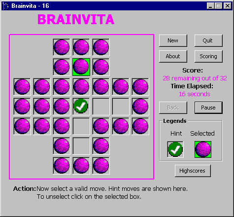



## A             000 Logical Game \- BrainVita"

### Description

Bored with simple programs? Then lets play Brainvita. Enjoy and learn how to write to the text files and how to read them. All the picture loading is done at the runtime. Hint moves are also shown, back button are there, highscores are also registered and much more... check it out and please vote for me...
 
### More Info
 
File "BVHigh.brh" should be available to store the highscores. If not available then run time error will occur and program will end. The file is provided in the code. Dont alter the contents of the file.

             |
---                |---
**Submitted On**   |2002-10-28 15:37:54
**By**             |[Mohd Frahim](https://github.com/Planet-Source-Code/PSCIndex/blob/master/ByAuthor/mohd-frahim.md)
**Level**          |Intermediate
**User Rating**    |4.5 (18 globes from 4 users)
**Compatibility**  |VB 6\.0
**Category**       |[Games](https://github.com/Planet-Source-Code/PSCIndex/blob/master/ByCategory/games__1-38.md)
**World**          |[Visual Basic](https://github.com/Planet-Source-Code/PSCIndex/blob/master/ByWorld/visual-basic.md)
**Archive File**   |[A\_000\_Logi14887810292002\.zip](https://github.com/Planet-Source-Code/mohd-frahim-a-000-logical-game-brainvita__1-40242/archive/master.zip)

